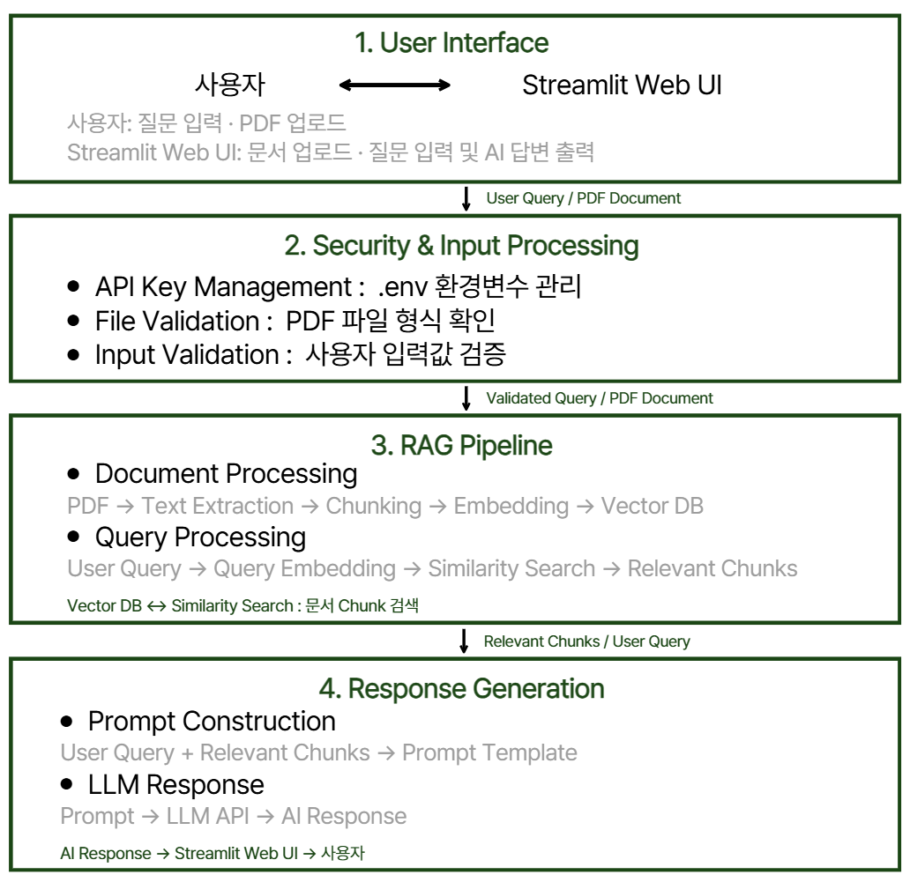

# 2주차 과제 | WorldVision AI Assistant

> RAG 기반 월드비전 관련 문서 질의응답 AI 에이전트 프로토타입

## 📌 프로젝트 개요

본 프로젝트는 월드비전 관련 문서를 기반으로 사용자의 질문에 답변하는
RAG(Retrieval-Augmented Generation) 기반 AI 에이전트 프로토타입입니다.

사용자의 질문과 관련된 정보를 문서에서 검색하고,
검색된 내용을 기반으로 LLM이 답변을 생성하도록 구현하여
문서 검색의 효율성을 높이고 근거 없는 답변 생성을 최소화하는 것을 목표로 합니다.

### 주요 구현 내용

- RAG 기반 문서 질의응답
- PDF 문서 기반 정보 검색
- Vector DB를 활용한 관련 문서 검색
- LLM API 연동 및 답변 생성
- 프롬프트 엔지니어링 기법 적용 및 비교
- 문서 내·외 질의를 활용한 응답 정확성 및 환각 억제 평가

## 시스템 아키텍쳐

  

업로드된 PDF 문서는 텍스트 추출 및 청킹 후 임베딩되어 Vector DB에 저장됩니다.  
사용자 질문은 유사도 검색을 통해 관련 문서 Chunk를 검색하고, 검색된 문맥과 함께 프롬프트를 구성하여 LLM에 전달됩니다.  
API Key는 `.env` 환경변수로 관리하며, 생성된 답변은 Streamlit Web UI를 통해 사용자에게 제공됩니다.

## 기술 스택

| 구분 | 사용 기술 | 활용 |
|---|---|---|
| Language | Python | RAG 프로토타입 구현 |
| Web UI | Streamlit | PDF 업로드 및 질의응답 인터페이스 |
| Framework | LangChain | RAG 파이프라인 및 프롬프트 구성 |
| Document Loader | PyMuPDFLoader | PDF 텍스트 추출 |
| Text Splitter | RecursiveCharacterTextSplitter | 문서 Chunk 분할 |
| Embedding | OpenAI Embeddings | 문서 및 질의 임베딩 |
| Vector DB | FAISS | 벡터 저장 및 유사도 검색 |
| LLM | GPT-4o | 검색 문맥 기반 답변 생성 |
| Environment | python-dotenv | API Key 환경변수 관리 |
